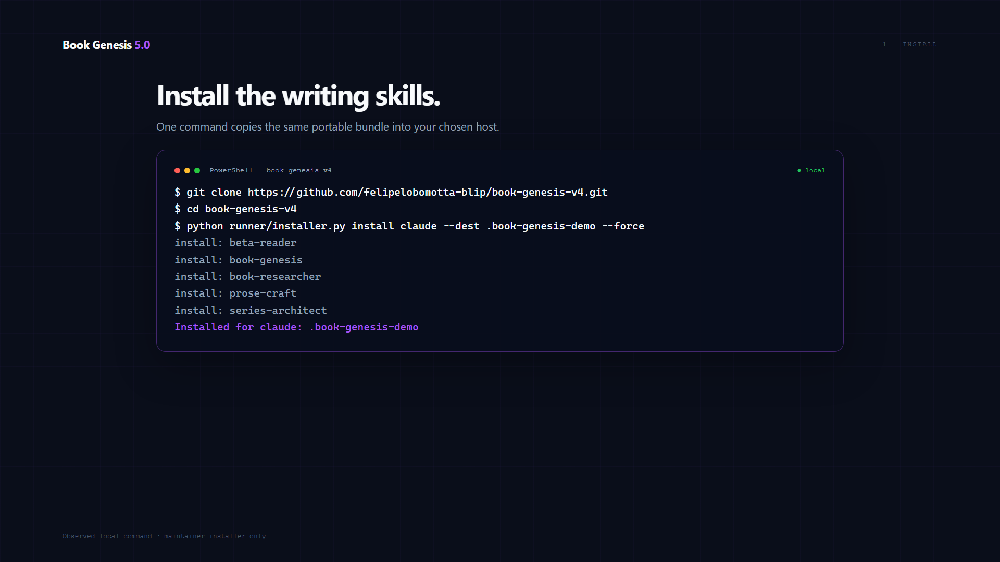
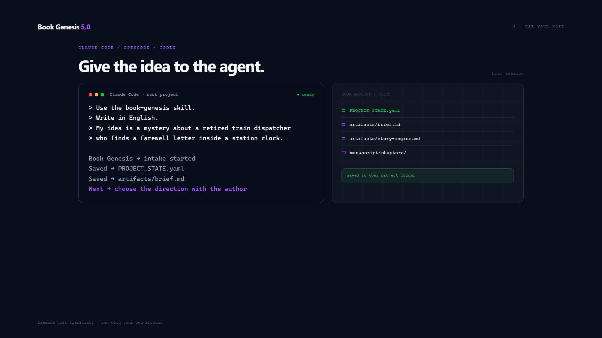
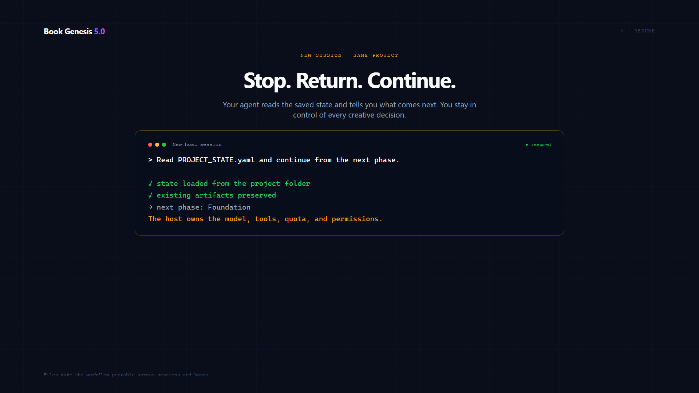

# Book Genesis 5.0

**Your creativity. Your agent. Your book.**

**Version 5.0.0 · Agent-native edition · MIT licensed**


An open-source collection of writing skills for the AI agent you already use. Book Genesis 5.0 installs into Claude Code, Codex, DeepSeek Harness, OpenCode, Cursor, GitHub Copilot, Qwen Code, Pi, Windsurf, Antigravity, Gemini CLI, Kimi Code, OpenClaw, or Hermes Agent. A shared directory target is also available.

Bring an idea. Book Genesis gives your agent a workflow for developing it into a manuscript: direction, characters, outline, chapters, editorial review, revision, and a publishing package. You keep the project files and creative decisions.

[MIT license](LICENSE) · [Installation guide](docs/portability.md) · [Compatibility evidence](docs/compatibility.md) · [Launch kit](marketing/agent-native/README.md) · [Project casebook](SHOWCASE.md)

## See it work

Watch the [48-second installation and host walkthrough](video-demo/out/install-demo.mp4) or download it from the [latest release](https://github.com/felipelobomotta-blip/book-genesis-v4/releases/latest). It shows a real local installer run, file verification, the prompt to use inside Claude Code/OpenCode/Codex, and a fresh-session resume from `PROJECT_STATE.yaml`.







The terminal installation and verification panels use output captured from the local 5.0 installer. The host conversation panels are an English usage example; model output depends on the host account, model, permissions, and quota.

**5.0 adds six host targets and removes the interactive book generator from the public product.** DeepSeek Harness, Cursor, GitHub Copilot, Qwen Code, Pi, and Windsurf receive the same 15-skill bundle. There are now **15 installation targets: 14 named hosts plus Shared**. Installation and file integrity are tested; native writing acceptance is tracked separately in the compatibility table.

## Back to the skills

The host agent handles models, authentication, tools, progress, and permissions. Book Genesis supplies the writing workflow and reference material. There is no hosted service, model API gateway, background agent farm, or interactive book-generation CLI in this release.

Earlier standalone-app experiments remain in Git history for provenance and are not part of the 5.0 product. Existing folders from those experiments are not automatically migrated.

## Install into your agent

You need Git and Python 3.10+ for this installer, plus the agent you want to use. The installer only copies skills and their references. It does not start a model, install the host agent, or collect API keys.

```bash
git clone https://github.com/felipelobomotta-blip/book-genesis-v4.git
cd book-genesis-v4
python runner/installer.py verify-suite
```

Choose **one** target:

```bash
python runner/installer.py install claude
python runner/installer.py install codex
python runner/installer.py install kimi
python runner/installer.py install openclaw
python runner/installer.py install hermes
python runner/installer.py install opencode
python runner/installer.py install antigravity
python runner/installer.py install gemini
python runner/installer.py install deepseek
python runner/installer.py install cursor
python runner/installer.py install copilot
python runner/installer.py install qwen
python runner/installer.py install pi
python runner/installer.py install windsurf
```

PowerShell and shell shortcuts are also included:

```powershell
.\install.ps1 -Target hermes
```

```bash
bash install.sh openclaw
```

Use `--dry-run` to preview an installation. Existing modified skills block replacement; an explicit `--force` backs them up first. See the [installation guide](docs/portability.md) for profiles, custom destinations, remote agents, and updates. Copying just `SKILL.md` is insufficient: the reference folders are part of the workflow.

Check the installed package before starting (use your chosen target):

```bash
python runner/installer.py verify-install opencode
```

This checks every skill and reference against your checkout. Confirm discovery in the host too: OpenCode exposes `opencode debug skill`; Gemini CLI exposes `gemini skills list`; Hermes exposes `hermes skills list`. See the [compatibility evidence and host checks](docs/compatibility.md).

## Give it an idea

Open a new session in your agent with a writable folder for your book, then say:

> Use the book-genesis skill. My idea is a mystery about a retired train dispatcher who finds a farewell letter inside a station clock. Help me choose the direction, then develop the outline and write the book. Save the chapters and project state so we can continue later. Write in English.

In hosts that expose skill commands, use `/book-genesis`. You can also ask for `book-bestseller-studio` when you want the broader research, editorial, positioning, and launch workflow.

The agent asks for missing creative decisions and works within its own context and quota limits. If interrupted, return to the same project folder and ask it to read `PROJECT_STATE.yaml`, inspect the saved chapters, and continue from the unfinished step.

## How it works

1. **Direction:** clarify the reader, premise, language, form, and intended length.
2. **Foundation and outline:** develop the characters or argument, voice, and chapter structure.
3. **Writing:** draft chapter blocks and preserve progress in files.
4. **Editorial review:** audit the manuscript, identify specific weaknesses, and revise their responsible sections.
5. **Delivery:** prepare the synopsis, positioning, cover brief, and editorial handoff.

The original core includes audit, revision, and scoring references. Scores are internal editorial signals. A strong score does not establish human preference, publication readiness, or sales. Specialist skills are available when relevant; installation does not launch a team of background processes.

## What you install

The same [15-skill suite](distribution/portable-suite.json) goes to every supported target. It includes the universal core, narrative foundation, prose craft, book research, editing, reader simulations, manuscript management, series planning, and editorial packaging.

| Host | Default destination |
| --- | --- |
| Claude Code | `~/.claude/skills/` |
| Codex | `~/.codex/skills/` |
| Kimi Code | `~/.kimi-code/skills/` |
| OpenClaw | `~/.openclaw/skills/` |
| Hermes Agent | `~/.hermes/skills/` |
| OpenCode | `~/.config/opencode/skills/` |
| Antigravity | `~/.gemini/config/skills/` |
| Gemini CLI | `~/.gemini/skills/` |
| DeepSeek Harness | `~/.dsh/skills/` |
| Cursor | `~/.cursor/skills/` |
| GitHub Copilot | `~/.copilot/skills/` |
| Qwen Code | `~/.qwen/skills/` |
| Pi | `~/.pi/agent/skills/` |
| Windsurf / Cascade | `~/.codeium/windsurf/skills/` |
| Shared Agent Skills | `~/.agents/skills/` via `install shared` |

Host-specific home variables and `--dest` override these locations. OpenCode also respects `XDG_CONFIG_HOME`; its explicit `OPENCODE_CONFIG_DIR` takes priority. The OpenClaw and Hermes destinations follow their official [OpenClaw](https://docs.openclaw.ai/tools/skills) and [Hermes](https://hermes-agent.nousresearch.com/docs/user-guide/features/skills) skill-directory conventions. Installer compatibility is tested separately from live writing in those hosts.

DeepSeek Harness respects `DSH_HOME`; Pi respects `PI_CODING_AGENT_DIR`. See [the six new host setup notes and official sources](docs/portability.md#deepseek-harness-cursor-copilot-qwen-pi-and-windsurf). The package is MIT licensed. Model usage may have a cost or quota under your host account.

## The work behind it

The [casebook](SHOWCASE.md) preserves earlier experiments, including *The Source Code*, *Protocolo Não Encontrado*, and *Age of Aquarius*. Case notes distinguish planned work, reported manuscript progress, and public artifacts. Private manuscripts and historical model scores are not independent product benchmarks.

The idea is simple: creativity should be the starting point. People should be able to explore a book with the tools they already have. Writing quality still depends on the idea, model, direction, and editorial work; a literal bestseller cannot be guaranteed.

The [architecture audit](docs/architecture-audit-20260910.md) records the reliability fixes and remaining limits.

## Development

The repository includes a small installer/verifier for maintainers and scripted environments. It does not call a model, generate a book, or run in the background. Your chosen host does the writing.

```bash
python -m unittest discover -s tests -v
```

[Contributing](CONTRIBUTING.md) · [Security](SECURITY.md) · [Changelog](CHANGELOG.md) · [Issues](https://github.com/felipelobomotta-blip/book-genesis-v4/issues)

Created by [Felipe Lobo](https://github.com/felipelobomotta-blip). MIT licensed.
